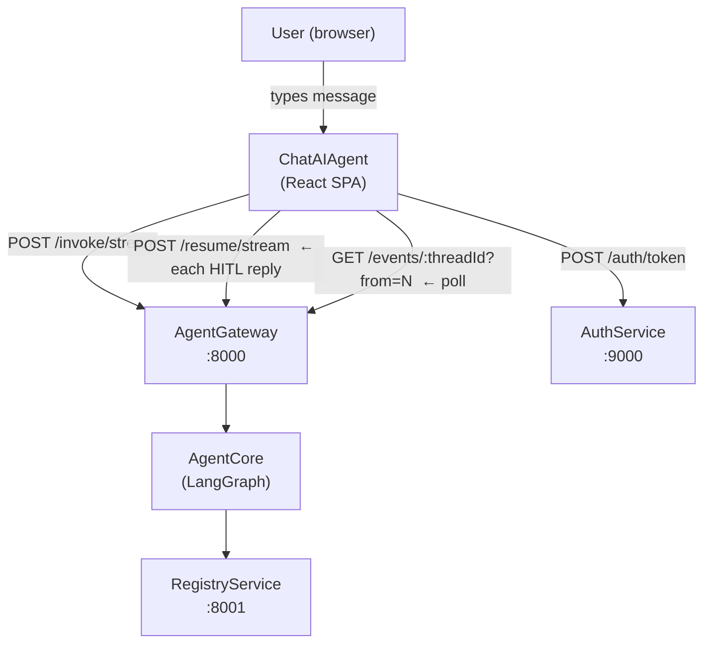
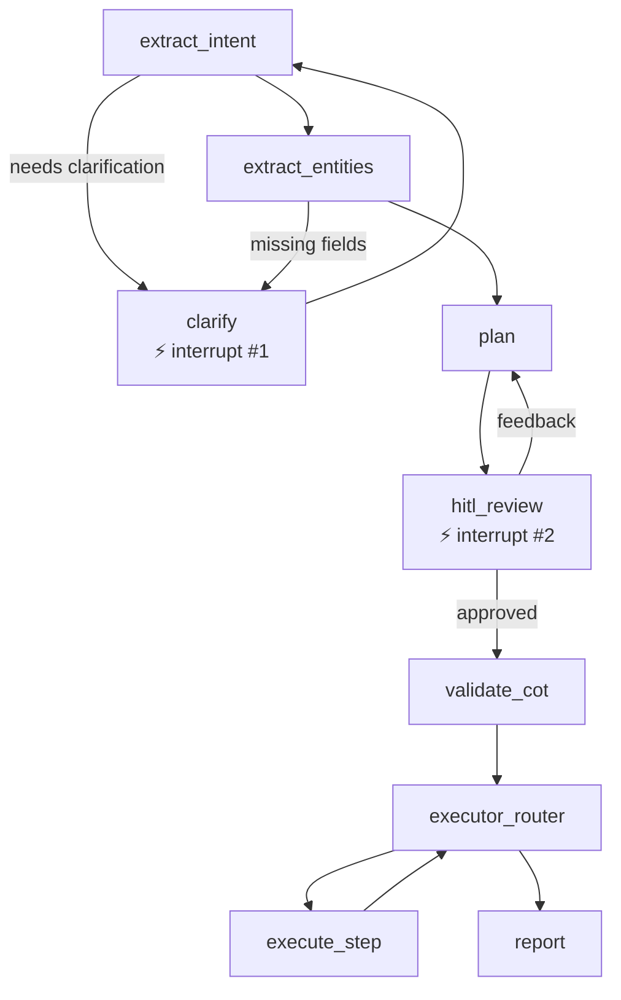
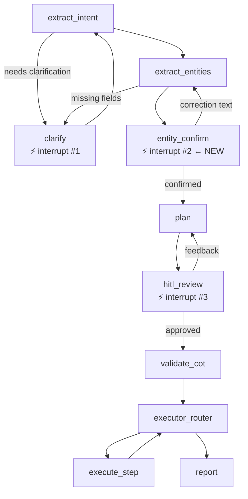
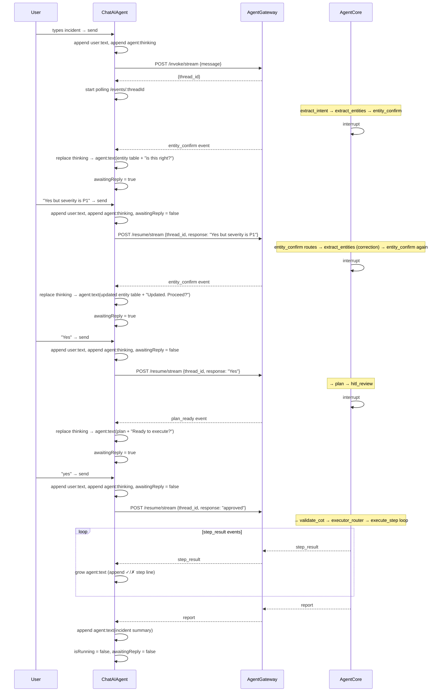

# ChatAIAgent — Design Document

> A standalone chat-interface client for any AgentCore-powered backend.
> SREDemo continues unchanged — this is a parallel consumer of the same AgentGateway APIs.

---

## Stage 1 — Section Breakdown

| # | Section | Deliverable | Status |
|---|---------|-------------|--------|
| 1 | Project scaffold | Folder, Vite + React + Tailwind, routing, login page | ✅ Done |
| 2 | Chat thread + message model | `ChatMessage` type, `ChatThread` renderer, auto-scroll | ✅ Done |
| 3 | `useChatThread` hook + `eventMapper` | Translates raw AgentBE events → semantic events → chat messages | ✅ Done |
| 4 | Chat input bar | Single input, active when `awaitingReply`, disabled while agent runs | ✅ Done |
| 5 | Execution stream | Step results rendered as growing text inside one agent message | ✅ Done |
| 6 | AgentCore: `entity_confirm` node | New `interrupt()` gate after `extract_entities` | ✅ Done |

---

## Motivation — Why Chat

The interaction with an agentic system is a **conversation**. The agent pauses multiple times to confirm before acting:

1. "I extracted these entities — is this right?"
2. "I need clarification before I can plan."
3. "Here's my plan — shall I execute?"
4. Future: mid-execution confirmations on risky steps

A modal blocks everything and hides context. A chat thread keeps the entire conversation visible — the user can scroll back, see what was confirmed, understand why the plan looks the way it does across revisions.

**The key insight**: no embedded buttons, no special cards. The agent writes a text message. The input bar becomes active. The user types back. That's the whole interaction model.

---

## HLD — High-Level Design

### System components



### AgentCore graph — current vs required

The chat UI has **three natural HITL checkpoints**. Each one must be a real `interrupt()` call in the LangGraph graph — you cannot fake a pause in the frontend alone. The backend must actually stop and wait.

**Current graph (2 interrupts):**



**Required graph (3 interrupts — adds entity confirmation):**



### What changed in AgentCore (all implemented)

| Component | Change |
|---|---|
| `agentcore/nodes/entity_confirm.py` | New node — `interrupt({"entities": state["entities"]})`. Affirmative replies proceed; any other text is injected as a `HumanMessage` and re-extraction runs. |
| `agentcore/graph/builder.py` | `entity_confirm` wired between `extract_entities` and `plan`. Correction loops back to `extract_entities`. |
| `agentcore/graph/routes.py` | `route_entities` now returns `"entity_confirm"` (was `"plan"`). New `route_entity_confirm` returns `"plan"` or `"extract_entities"`. |
| `agentcore/graph/state.py` | Added `entity_confirm_response: str \| None`. |

### How the event reaches the frontend (no AgentGateway changes needed)

AgentBE's `_publish_stream` already serialises any `interrupt()` call as:
```json
{ "type": "interrupt", "next": ["entity_confirm"], "interrupts": [{"entities": {...}}] }
```
`eventMapper.ts` in ChatAIAgent detects `next.includes("entity_confirm")` and emits an `entity_confirm` event with the entities payload. The hook then formats them as markdown and sets `awaitingReply = true`.

### What the frontend hook does

`useChatThread` uses `eventMapper.ts` to translate all raw AgentBE events (`on_chain_end`, `interrupt`, etc.) into semantic events before the `handle()` switch processes them. This was also the fix for a latent bug where the hook was receiving raw `on_chain_end` events it had no case for.

---

## Chat Message Model

Two roles, three kinds. That's it.

```typescript
type MessageRole = 'user' | 'agent'
type MessageKind  = 'text' | 'thinking' | 'error'

interface ChatMessage {
  id:        string
  role:      MessageRole
  kind:      MessageKind
  timestamp: number
  text?:     string   // markdown — rendered for agent messages
}
```

All agent intelligence — entities, plan steps, step results, report — is **formatted text** inside a normal agent message. The frontend renders it as markdown. There are no special card components.

---

## Thread Evolution — VPN Incident

```
[user]  "Our VPN tunnels to Boston, New York and Chicago keep dropping.
         Phase 2 keeps renegotiating. ERP and VoIP degraded, 450 users."

[agent] •••  (thinking)

[agent] "I extracted these from your incident:

         | Field             | Value                          |
         |-------------------|--------------------------------|
         | incident_type     | vpn_tunnel_flap                |
         | severity          | P2                             |
         | ike_phase         | phase2                         |
         | affected_branches | Boston, New York, Chicago      |
         | affected_services | ERP, VoIP                      |
         | customer_facing   | true (450 users)               |

         Does this look right? Confirm or tell me what to correct."

         ← input bar becomes active

[user]  "Yes but severity should be P1"

[agent] •••

[agent] "Got it — updating to P1. Here's my remediation plan:

         **Wave 1 — Discover (parallel)**
         - aws_describe_vpn_connections → find the 3 flapping tunnels
         - pd_create_incident → open P1 ticket immediately

         **Wave 2 — Verify**
         - aws_describe_customer_gateway → confirm BGP config
         - dd_query_metrics → confirm flapping pattern

         **Wave 3 — Remediate (parallel)**
         - aws_reset_vpn_tunnel × 3 (one per connection)

         **Wave 4 — Confirm**
         - aws_describe_vpn_connections → verify tunnels are UP

         Ready to execute? Reply 'yes' to proceed, or describe any changes."

         ← input bar active

[user]  "yes"

[agent] •••

[agent] "Executing...

         ✓ **aws_describe_vpn_connections** — found vpn-abc123, vpn-def456, vpn-ghi789
         ✓ **pd_create_incident** — INC-4821 opened (P1)
         ✓ **aws_describe_customer_gateway** — cgw-0a1b2c3d, BGP ASN 65001
         ✓ **dd_query_metrics** — tunnel flap confirmed, started 14:32 UTC
         ✓ **aws_reset_vpn_tunnel** vpn-abc123 — tunnel UP
         ✓ **aws_reset_vpn_tunnel** vpn-def456 — tunnel UP
         ✓ **aws_reset_vpn_tunnel** vpn-ghi789 — tunnel UP
         ✓ **aws_describe_vpn_connections** — all 3 tunnels confirmed UP"

[agent] "**Incident resolved.**

         - Tunnels reset: 3 (Boston, New York, Chicago)
         - Users restored: ~450
         - PagerDuty: INC-4821
         - Total time: 2m 14s

         Phase 2 renegotiation caused by DPD timeout mismatch on the customer
         gateway. Recommend aligning DPD settings across all branch CGWs."
```

---

## Input Bar State

| Agent state | Input bar |
|---|---|
| idle (no session) | Active — start a new incident |
| `streaming` (agent running) | **Disabled** |
| `entities` received | Active — agent is asking for confirmation |
| `clarifying` | Active — agent is asking a question |
| `hitl_pending` (plan ready) | Active — agent is asking for approval |
| `executing` | **Disabled** |
| `complete` or `error` | Active — start a new incident |

One rule: **active when the agent is waiting for a reply, disabled when it isn't.**

The placeholder text changes to hint what kind of reply is expected:
- After entities: _"Confirm or correct the extracted details…"_
- After clarification question: _"Type your answer…"_
- After plan: _"Reply 'yes' to execute, or describe changes…"_
- Idle: _"Describe the incident…"_

---

## LLD — Hook and Component Signatures

### `useChatThread`

```typescript
interface UseChatThreadReturn {
  messages:       ChatMessage[]
  awaitingReply:  boolean   // true → input bar is active; agent has paused
  placeholder:    string    // hint text for the input bar
  isRunning:      boolean   // true → agent is actively processing (spinner)
  send:           (text: string) => Promise<void>  // works for both invoke and resume
  reset:          () => void
}
```

`send` internally decides:
- `threadId === null` → `invokeStream(text)` (new session)
- `threadId !== null && awaitingReply` → `resumeStream(threadId, text)`

### Agent event → message text mapping

| Event | Action |
|---|---|
| invoke called | append `user:text`, append `agent:thinking` |
| `entities` | replace thinking with `agent:text(formatted entity table + question)` |
| `clarification_needed` | replace thinking with `agent:text(question)` |
| `plan_ready` | append `agent:thinking`, replace with `agent:text(formatted plan + question)` |
| `step_result` | upsert a single `agent:text` message (append step line to growing text) |
| `report` | append `agent:text(report summary)` |
| `error` | append `agent:error` |
| `done` | set `isRunning = false` |

### Component tree

```
ChatPage
├── ChatHeader      (logo, username, status, nav)
├── ChatThread      (flex-col, overflow-y-auto, flex-1, auto-scroll)
│   └── ChatMessage[]
│       ├── UserBubble      (role: user, kind: text)
│       ├── AgentBubble     (role: agent, kind: text — renders markdown)
│       ├── ThinkingBubble  (role: agent, kind: thinking — animated dots)
│       └── ErrorBubble     (role: agent, kind: error)
└── ChatInputBar    (pinned bottom)
    ├── textarea    (active/disabled by awaitingReply)
    └── send button
```

No cards. No modals. No embedded action buttons.

---

## Sequence Diagram — Full 3-Interrupt Flow



> `clarify` (interrupt #0) can fire before `entity_confirm` if `extract_intent` finds the query too ambiguous to even attempt entity extraction. All three HITL gates flow through the same `send()` → `resumeStream()` path in the hook.

---

## Folder Structure

```
ChatAIAgent/
  DESIGN.md
  README.md
  frontend/
    index.html
    package.json
    tsconfig.json
    vite.config.ts
    tailwind.config.ts
    src/
      main.tsx
      App.tsx
      index.css
      lib/
        types.ts          ← ChatMessage + shared types
        gateway.ts        ← invoke, resume, getEvents, login
        formatter.ts      ← agent event → markdown text
      hooks/
        useSession.ts
        useChatThread.ts  ← messages[], awaitingReply, send, reset
      components/
        ChatHeader.tsx
        ChatThread.tsx
        ChatMessage.tsx   ← dispatches to UserBubble / AgentBubble / ThinkingBubble / ErrorBubble
        ChatInputBar.tsx
        UserBubble.tsx
        AgentBubble.tsx   ← renders markdown
        ThinkingBubble.tsx
        ErrorBubble.tsx
      pages/
        LoginPage.tsx
        ChatPage.tsx
```

---

## Design Decisions

| Decision | Chosen | Alternative | Why |
|---|---|---|---|
| Agent output format | Markdown text | Structured card components | Chat is text. Structure lives in the agent's message, not in React components. |
| HITL interaction | Input bar at the bottom | Embedded buttons in messages | Single consistent interaction pattern; no UI state per-message |
| Input bar enable rule | `awaitingReply` boolean | Per-HITL-type logic | Simpler; the agent message already tells the user what it needs |
| Execution updates | Grow a single agent:text message | One message per step | Reads like a live terminal; avoids message list explosion |
| Shared gateway.ts | Copied from SREDemo | Shared npm package | Demo project; extraction adds friction without benefit |
