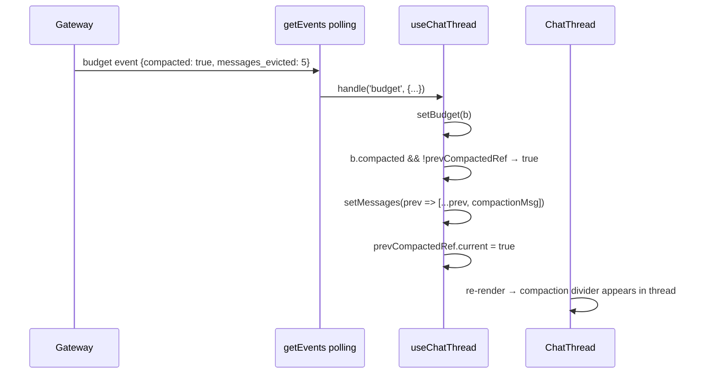
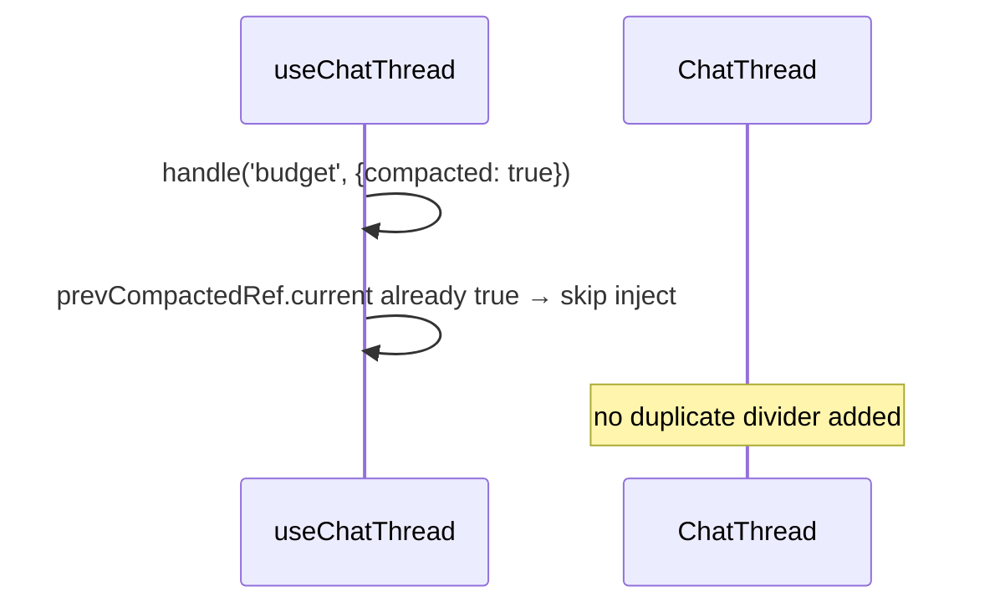

# Design: Context Budget Fix — Section 4: Inline Compaction Message in Chat Thread

feature: context-budget-fix
section: 4 of 4 (ChatAIAgent)
depends-on: section-3-compaction-writeback.md
status: draft

## What This Section Covers

When compaction fires, inject a persistent system notice into the chat message thread.

The existing UI already has:
- `CompactionBanner` — orange toast that slides in for 4 seconds (ChatPage.tsx:63)
- `BudgetGauge` — arc gauge with "↳ Compacted · −N msgs" indicator (ChatHeader)
- `WarningBanner` — yellow/red strip at high usage

What is missing: a **durable record in the chat thread itself**. The banner disappears
after 4 seconds. A user who is scrolled down or looks away sees nothing. The conversation
history has no marker that compaction happened and why.

This section adds a `'compaction'` message kind that appears inline between messages
as a subtle system notice — permanent until the session resets.

---

## HLD

### Component diagram

```mermaid
flowchart TD
    GW[Gateway\nPOST /invoke response\ncontext_budget.compacted=true]
    POLL[GET /events\nbudget event with compacted=true]
    HOOK[useChatThread\nbudget case handler]
    MSGS[messages state\nChatMessage[]]
    THREAD[ChatThread.tsx\nrender compaction kind]

    GW --> POLL
    POLL -->|mapped budget event| HOOK
    HOOK -->|inject compaction message| MSGS
    MSGS --> THREAD
```

### Data flow

1. Gateway emits `context_budget: {compacted: true, messages_evicted: 5, ...}` in the
   invoke response. The streaming path converts this to a `budget` event on the polling
   channel.
2. `useChatThread` receives the `budget` event. When `compacted` transitions from
   `false → true`, it appends a compaction `ChatMessage` to `messages`.
3. `ChatThread.tsx` renders it as a centered system notice — not a chat bubble.

### What the inline message looks like

```
──────────────────────────────────────────────────────
    ⚡ Context compacted — 5 older messages summarized
        to stay within the session budget.
──────────────────────────────────────────────────────
```

Subtle divider style, not a chat bubble. Same visual weight as a "new conversation"
separator — informational, not alarming.

### Key decisions

| Decision | Rationale |
|---|---|
| New `'compaction'` MessageKind, not reuse `'text'` | Needs distinct rendering — no avatar, no timestamp label, centered divider |
| Inject in `useChatThread` on `budget` transition | Single place where compaction state is already detected (prevCompacted ref exists) |
| Keep CompactionBanner as-is | It handles the immediate toast. Inline message handles the persistent record. Both serve different needs. |
| Message text includes `messages_evicted` count | Gives the user a concrete number, not just "something happened" |

---

## LLD

### `types.ts` — add compaction to MessageKind

```typescript
// Before:
export type MessageKind = 'text' | 'thinking' | 'error'

// After:
export type MessageKind = 'text' | 'thinking' | 'error' | 'compaction'

// Add fields to ChatMessage for compaction payload:
export interface ChatMessage {
  id: string
  role: MessageRole
  kind: MessageKind
  timestamp: number
  text?: string
  messagesEvicted?: number   // only set when kind === 'compaction'
}
```

### `useChatThread.ts` — inject compaction message on transition

```typescript
case 'budget': {
  const b = data as unknown as BudgetState
  setBudget(b)
  setBudgetHistory(prev => [...prev, { tokens: b.estimated_tokens, ts: Date.now() }])

  // NEW: inject inline compaction message on OPEN transition
  if (b.compacted && !prevCompactedRef.current) {
    setMessages(prev => [...prev, {
      id: uid(),
      role: 'agent',
      kind: 'compaction',
      timestamp: Date.now(),
      messagesEvicted: b.messages_evicted,
    }])
  }
  prevCompactedRef.current = b.compacted
  break
}
```

Note: `prevCompactedRef` is a new `useRef<boolean>(false)` — same pattern as
`prevCompacted` in `ChatPage.tsx` but lives in the hook so the message injection
and the banner trigger share the same source.

### `ChatThread.tsx` — render compaction kind

```tsx
// Inside the messages.map():
if (msg.kind === 'compaction') {
  return (
    <div key={msg.id} className="flex items-center gap-3 px-6 py-2 select-none">
      <div className="flex-1 h-px bg-orange-200" />
      <span className="text-[11px] text-orange-600 flex items-center gap-1 whitespace-nowrap">
        <Zap className="w-3 h-3" />
        Context compacted
        {msg.messagesEvicted
          ? ` — ${msg.messagesEvicted} older messages summarized`
          : ''}
      </span>
      <div className="flex-1 h-px bg-orange-200" />
    </div>
  )
}
```

Import `Zap` from `lucide-react` (already used in `CompactionBanner.tsx`).

### Error handling / edge cases

| Scenario | Behaviour |
|---|---|
| `budget.compacted` stays `true` across multiple events | `prevCompactedRef` prevents duplicate messages — only first transition inserts |
| Session reset (`reset()`) | `messages` cleared, `prevCompactedRef` set to `false` |
| `messages_evicted` is 0 or undefined | Text falls back to "Context compacted" without the count |
| Budget event arrives before any chat messages | Compaction message appended to (possibly empty) array — shows correctly when user starts |

---

## Sequence Diagrams

### Compaction detected → inline message injected



### Second budget event with compacted=true (no duplicate)


