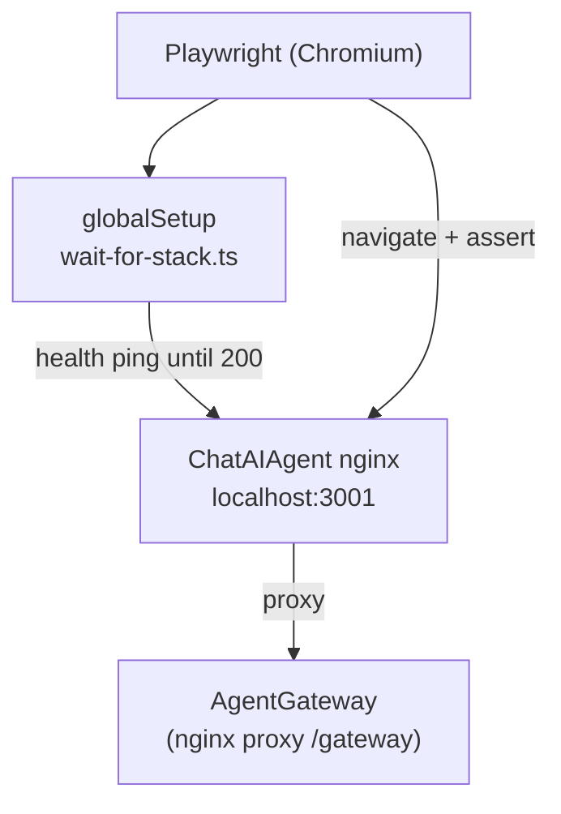
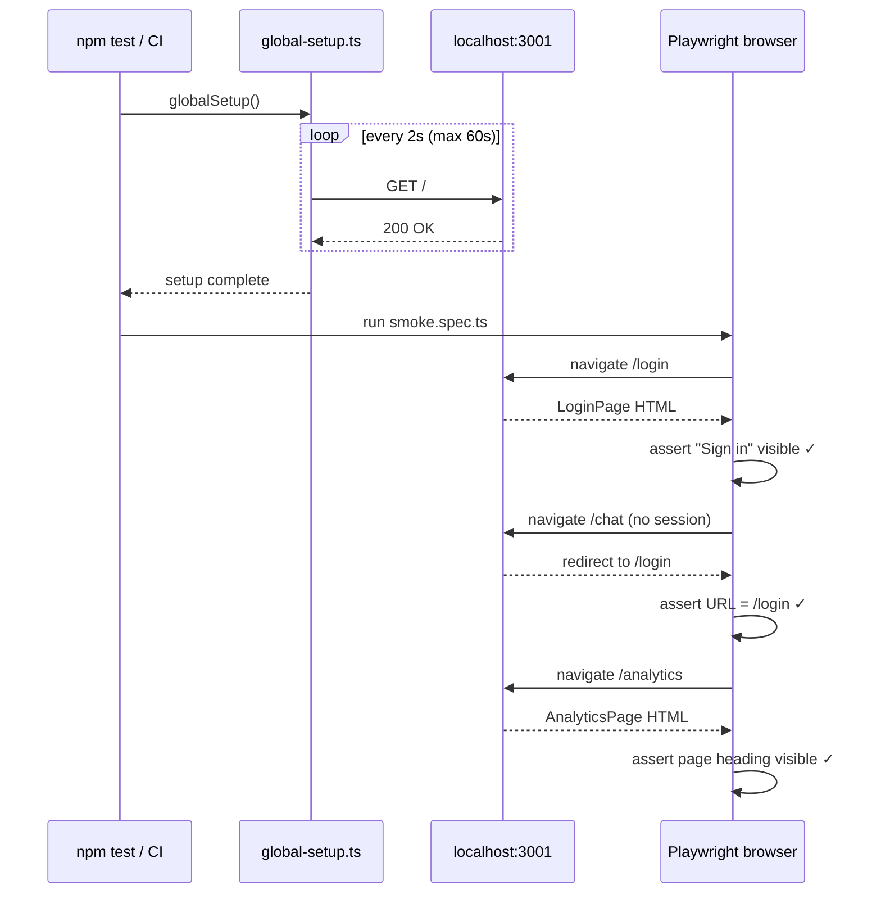

# Design: E2E Scaffold + Smoke Tests (Section 1)

## HLD

### What this is
A Playwright test suite that runs browser-driven assertions against the live
ChatAIAgent stack. The stack is already up (Docker Compose started by the user).
Playwright opens a real Chromium browser, navigates the UI, and asserts DOM state.

### Component diagram



### Key decisions

| Decision | Chosen | Why |
|----------|--------|-----|
| Test location | `ChatAIAgent/e2e/` (own package.json) | Keeps Playwright deps out of the React app; separate install |
| baseURL | `http://localhost:3001` | Only port exposed by Docker Compose |
| Stack wait | `globalSetup` polls until 200 with 60s timeout | Stack takes ~10s to be healthy after `docker compose up` |
| No `webServer` block | Omitted | Stack is started externally, not by Playwright |

---

## LLD

### File structure

```
ChatAIAgent/e2e/
  package.json              ← @playwright/test only
  playwright.config.ts      ← baseURL, globalSetup, reporter
  global-setup.ts           ← wait-for-stack health check
  tests/
    smoke.spec.ts           ← 3 smoke tests
```

### `playwright.config.ts`

```typescript
import { defineConfig } from '@playwright/test'

export default defineConfig({
  testDir: './tests',
  globalSetup: './global-setup',
  use: { baseURL: 'http://localhost:3001', headless: true },
  timeout: 30_000,
  reporter: [['list'], ['html', { open: 'never' }]],
})
```

### `global-setup.ts`

Polls `GET http://localhost:3001/` every 2s until HTTP 200 or 60s timeout.
Throws on timeout so tests fail fast with a clear message rather than flaky
"element not found" errors.

```typescript
async function waitForStack(): Promise<void>
// polls with fetch(), timeout 60s, interval 2s
// throws: "ChatAIAgent stack not ready after 60s — is Docker Compose running?"
```

### `smoke.spec.ts` — 3 tests

| Test | What it asserts |
|------|----------------|
| `login page loads` | `/login` → "Sign in" heading visible, username + password inputs present |
| `unauthenticated /chat redirects to login` | navigate to `/chat` with empty sessionStorage → URL becomes `/login` |
| `analytics page loads` | navigate to `/analytics` → page title or heading visible (no auth guard on analytics) |

### Error handling

- `global-setup` timeout → process exits non-zero; all tests report as skipped with setup error
- Test assertion failures → standard Playwright failure output with screenshot on fail

### Config / env vars introduced

| Var | Default | Purpose |
|-----|---------|---------|
| `E2E_BASE_URL` | `http://localhost:3001` | Override for CI environments |
| `E2E_TIMEOUT_MS` | `60000` | Stack wait timeout |

---

## Sequence Diagram


