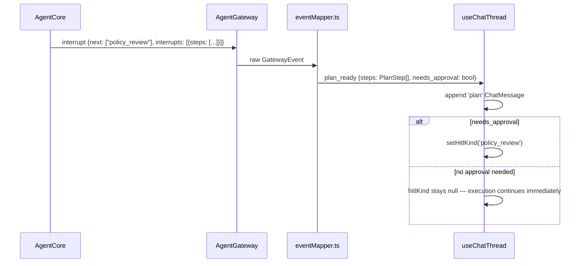

# Section 5 — Event Mapping + Hook Wiring

## HLD

### Event flow



### Key Decisions

| Decision | Choice | Reason |
|---|---|---|
| Plan as interrupt | Yes, when `require_approval` present | Reuses existing HITL pause machinery |
| Plan as node event | When no approval needed, `on_chain_end` from plan node | No pause needed, just show and continue |
| Two paths | interrupt vs node event | Same PlanBubble rendered; only HITL state differs |

---

## LLD

### `gateway.ts` — new GatewayEvent shape

```ts
// Add to GatewayEvent union:
| { type: 'interrupt'; next: string[]; interrupts: Record<string, unknown>[] }
// (already exists — no change needed)

// AgentGateway passes through policy_review interrupts unchanged
```

### `eventMapper.ts` — new mappings

```ts
// In the interrupt branch, add before the final return []:

// policy_review — payload has {steps: PlanStep[]}
if (next.includes('policy_review')) {
  const steps = (payload['steps'] ?? []) as PlanStep[]
  const needsApproval = steps.some(s => s.policy === 'require_approval')
  return [{
    name: 'plan_ready',
    data: { steps, needs_approval: needsApproval },
  }]
}

// plan on_chain_end (no approval required — just display)
if (ev.event === 'on_chain_end' && node === 'plan' && output?.['steps']) {
  const steps = output['steps'] as PlanStep[]
  return [{ name: 'plan_ready', data: { steps, needs_approval: false } }]
}
```

### `useChatThread.ts` — new handler case

```ts
case 'plan_ready': {
  const steps = data.steps as PlanStep[]
  const needsApproval = data.needs_approval as boolean
  const m = make('agent', 'plan')
  m.planSteps = steps
  setMessages(prev => [...prev, m])
  if (needsApproval) setHitlKind('policy_review')
  break
}
```

### Placeholder text for `policy_review` HITL

```ts
: hitlKind === 'policy_review'
  ? "Type 'approve' to proceed, or 'reject' to cancel…"
```

### Error Handling

| Case | Behavior |
|---|---|
| `steps` missing from payload | Render empty PlanBubble with "No steps in plan" |
| All steps blocked | `needs_approval = false`; PlanBubble shows all red; execution skipped by AgentCore |
| User rejects | `resumeStream` sends "reject"; AgentCore handles cancellation |
