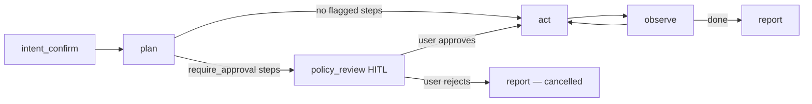
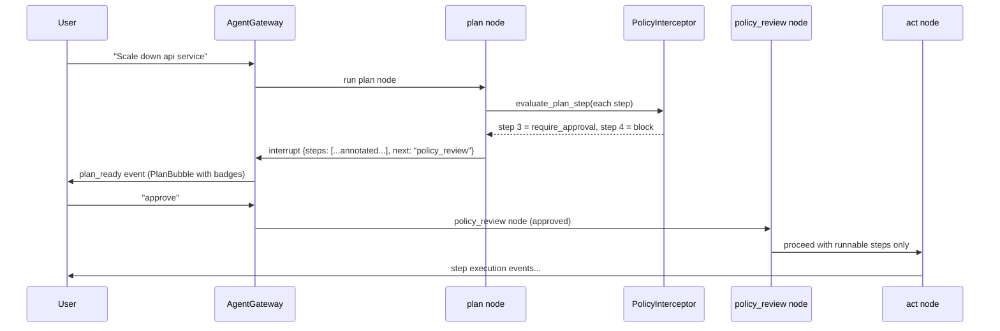
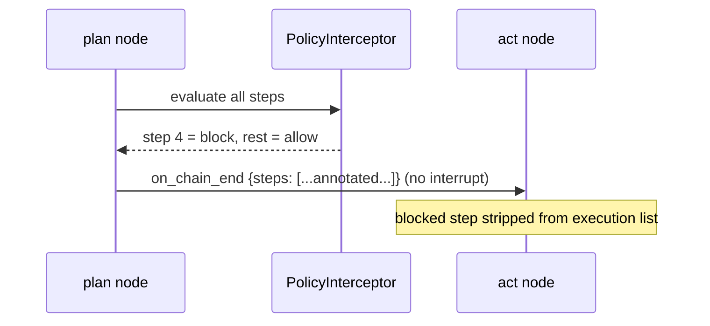

# Section 6 — AgentCore: Plan Emit + Policy Evaluation

## HLD

### Where this fits in the LangGraph graph



The `plan` node now runs the PolicyInterceptor across all planned steps **before**
emitting anything. Blocked steps are stripped from the execution list. Steps requiring
approval trigger an interrupt.

### Key Decisions

| Decision | Choice | Reason |
|---|---|---|
| Evaluate at plan time | Yes — whole plan at once | One round-trip to Registry per run, not per step |
| Blocked steps | Removed from execution plan; kept in interrupt payload for display | Agent doesn't try to execute them; UI still shows them |
| Require-approval steps | Kept in plan; agent pauses at `policy_review` node | User sees them before anything runs |
| Policy fetch | `PolicyInterceptor._fetch_rules(domain)` — same cached call as Section 3 | No new HTTP calls |

---

## LLD

### Changes to `agentcore/nodes/plan.py`

```python
async def plan_node(state: AgentState, config: RunnableConfig) -> AgentState:
    # ... existing planning logic produces `steps: list[PlanStep]` ...

    # Annotate each step with policy decision
    interceptor = get_policy_interceptor()   # reads from config / singleton
    if interceptor:
        for step in steps:
            try:
                decision = await interceptor.evaluate_plan_step(
                    domain=state.domain,
                    tool_name=step.tool_name,
                    args=step.inputs,
                )
                step.policy = decision        # 'allow' | 'block' | 'require_approval'
                step.policy_rule = decision.rule_description
            except Exception:
                pass  # fail-open: policy errors don't block planning

    # Split: blocked steps excluded from execution; flagged steps trigger interrupt
    blocked   = [s for s in steps if s.policy == 'block']
    flagged   = [s for s in steps if s.policy == 'require_approval']
    runnable  = [s for s in steps if s.policy not in ('block',)]

    state.plan_steps = runnable   # what will actually execute
    state.plan_all   = steps      # full list for display (including blocked)

    if flagged:
        # Pause — emit interrupt; ChatAIAgent shows PlanBubble with badges
        raise NodeInterrupt({
            "steps": [s.to_dict() for s in steps],   # all steps, annotated
            "next": "policy_review",
        })

    # No approval needed — emit plan as node event and continue
    return state
```

### New node: `policy_review` (HITL resume point)

```python
async def policy_review_node(state: AgentState, config: RunnableConfig) -> AgentState:
    # Called after user responds to PlanBubble prompt
    human_reply = state.pending_human_input.strip().lower()
    if human_reply == 'reject' or human_reply.startswith('reject'):
        state.cancelled = True
        state.cancellation_reason = "User rejected policy-flagged steps"
    # else: approved — execution continues with state.plan_steps (blocked already stripped)
    return state
```

### `PlanStep.to_dict()` output shape

```python
{
  "step_number": 3,
  "tool_name": "scale_down_replicas",
  "inputs": {"service": "api", "replicas": 1},
  "reason": "Scale down to reduce load",
  "policy": "require_approval",           # or "block" or absent
  "policy_rule": "Never scale below minimum replicas without approval"
}
```

---

## Sequence Diagrams

### Plan with approval-required step



### Plan with only blocked steps (no interrupt)


